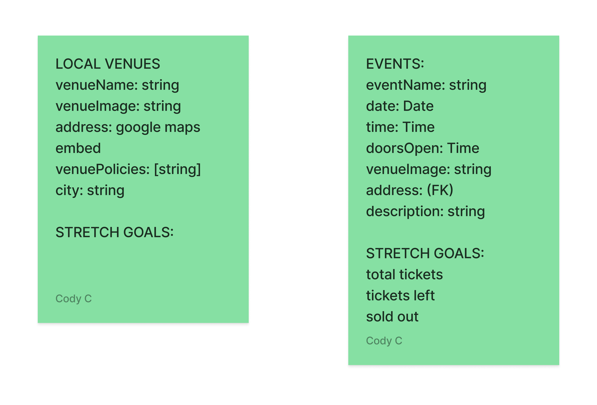

# Tick-iT-BackEnd
Tick-iT is a competition to Ticket Master, where it offers a more competive rates and fees for enjoying great events happening locally in LA and Atlanta. Tick-iT Backend supports the backend database of 'Tick-iT' app. 

<h2>Obejctive</h2>
We are building a REST-ful API with Django in order to call data from the front end. Using Django our database will have a full CRUD functions and a superuser ID and password to access and manage the database data as an authorized admin. We used proper modeling will organize the data into categories optimized to 'GET' data from the front end, and we also used the HyperlinkModelSerializer to link one model to another.

<h2> Devlopers</h2>

Clora V  
Cody Cadena  
Daisy Ban  
Joy Wu  

<h2> ERD </h2>
</img>

<h2> Link to Tick-iT-Frontend </h2>
https://github.com/codydecoder/Tick-iT-FrontEnd/issues/1